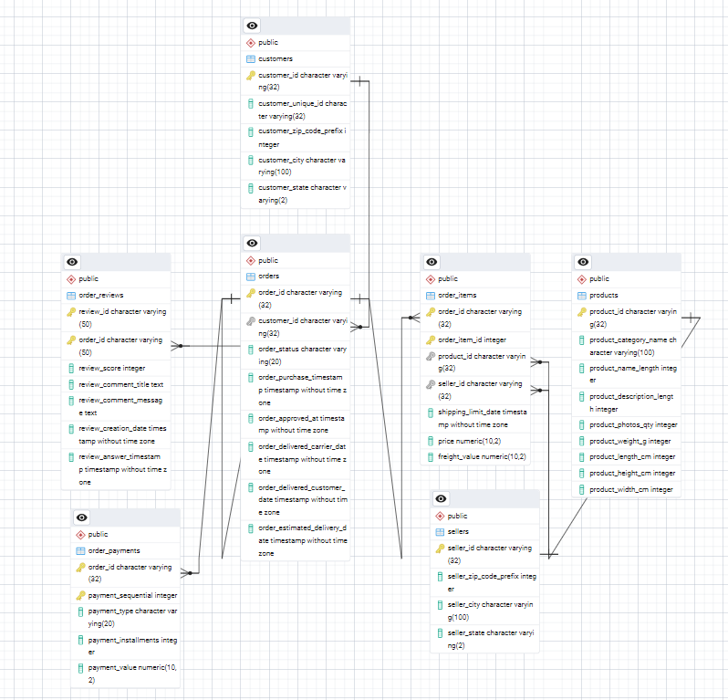
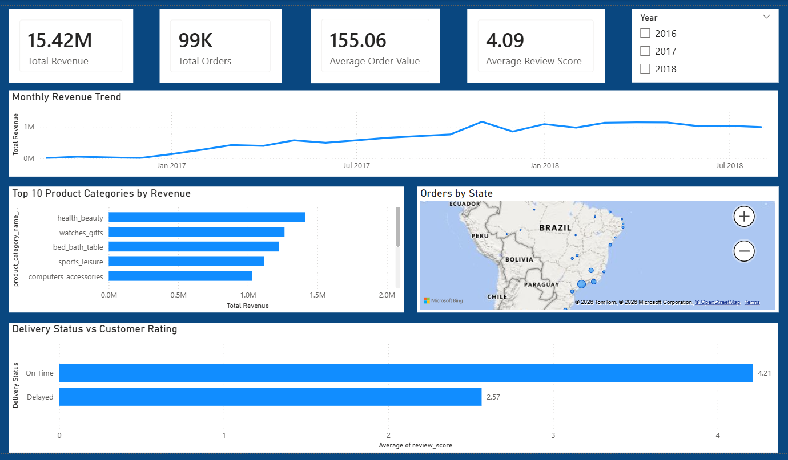

# Olist E-commerce Sales Analysis (SQL + Power BI)

## Project Overview

This project analyzes the Olist Brazilian e-commerce dataset to understand sales performance, customer behavior, seller contribution, and delivery efficiency.

The analysis was performed using SQL for data processing and Power BI for visualization, focusing on extracting actionable business insights from raw transactional data.

---

## Dataset

Source: https://www.kaggle.com/datasets/olistbr/brazilian-ecommerce

The dataset contains transactional data from a Brazilian e-commerce marketplace, including:

- ~100K orders  
- ~99K customers  
- ~3K sellers  
- ~32K products  
- Payment and review information  

It captures the full order lifecycle from purchase to delivery.

---

## Tools Used

- SQL (PostgreSQL)
- Power BI
- Git & GitHub

---

## Database Schema

The dataset consists of multiple relational tables connected through order_id, customer_id, and product_id.

Key relationships:

customers → orders → order_items → products  
                  ↓  
                  sellers  

orders → order_payments  
orders → order_reviews  

### ER Diagram

---

## Data Cleaning and Validation

Before analysis, several data quality checks were performed:

- Verified row counts after data import  
- Checked for duplicate primary keys  
- Identified and handled missing values  
- Validated delivery timestamps  
- Ensured price and freight values were non-negative  
- Verified relationships between tables  

These steps ensured the data used for analysis was reliable.

---

## Exploratory Data Analysis

Initial analysis focused on understanding overall performance:

- Total orders and revenue  
- Average order value  
- Monthly revenue trends  
- Payment method distribution  
- Top product categories  
- Geographic distribution of orders  
- Customer review distribution  

---

## Advanced Analysis

Advanced SQL queries were used to analyze:

- Customer purchase frequency (repeat vs one-time customers)  
- Customer lifetime value (CLV)  
- Seller revenue ranking  
- Revenue concentration among top sellers  
- Delivery delay patterns  
- Impact of delivery delays on customer reviews  

---

## Power BI Dashboard

A Power BI dashboard was created to visualize key insights.

The dashboard includes:

- Overall KPIs (Revenue, Orders, AOV, Review Score)  
- Monthly revenue trend  
- Top product categories by revenue  
- Orders by state (geographic distribution)  
- Delivery performance vs customer reviews  
- Year filter for interactive analysis  

### Dashboard Preview

---

## Key Insights

- A large portion of customers place only one order, indicating low repeat purchase behavior  
- A small group of sellers contributes a significant share of total revenue  
- Categories such as Health & Beauty and Watches & Gifts generate the highest sales  
- Orders delivered on time receive higher review scores than delayed orders  
- Most orders originate from major urban regions such as São Paulo  

---

## Project Structure

olist-ecommerce-analysis  
│  
├── sql  
│   ├── schema.sql  
│   ├── data_cleaning_validation.sql  
│   ├── exploratory_analysis.sql  
│   └── advanced_business_analysis.sql  
│  
├── dashboard  
│   └── olist_dashboard.pbix  
│  
├── images  
│   ├── erd.png  
│   └── dashboard.png  
│  
└── README.md  

---

## Conclusion

This project demonstrates an end-to-end data analysis workflow, including data validation, SQL-based analysis, and dashboard creation.

It highlights how transactional data can be used to derive insights that support business decisions, improve customer experience, and identify operational challenges.

---

## Author

Meghana Adepu
